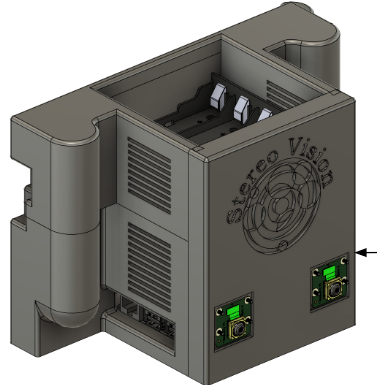
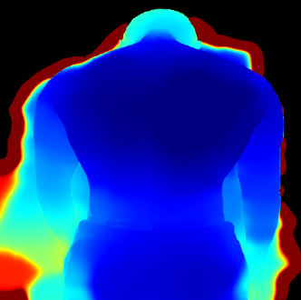
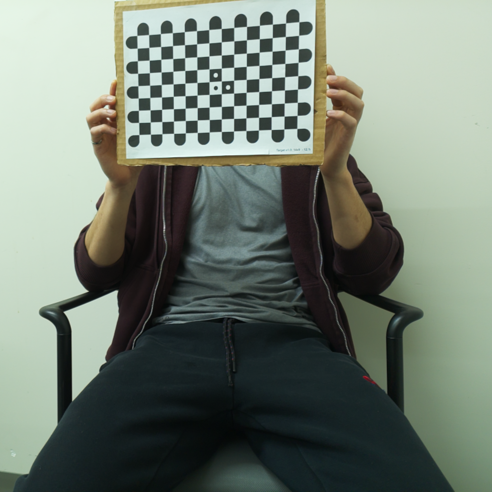
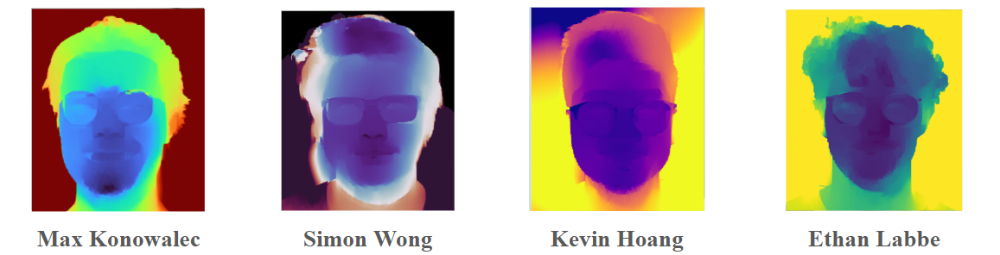

# Handheld Stereo Vision System


A completed, Raspberry Pi–based stereo vision system for capturing paired camera images, applying calibrated stereo processing, estimating disparity/depth, displaying results through a local user interface, and transferring imagery or outputs to a remote client.

The repository is organized as a modular Python project. Hardware-specific code, capture logic, stereo algorithms, networking, calibration artifacts, UI components, performance tools, and development/test scripts are separated into focused modules.

<table>
	<tr>
		<td></td>
		<td></td>
		<td></td>
	</tr>
</table>

## Authors




## Overview

This capstone project implements the software stack for a handheld stereo vision device. The system is intended to run on a Raspberry Pi connected to a stereo camera rig, process left/right image pairs using saved calibration parameters, and provide local and remote access to visual outputs.

The project supports the following system-level functions:

- Stereo image acquisition from the Raspberry Pi camera platform.
- Raspberry Pi-specific runtime and hardware integration.
- Shared stereo-vision abstractions and processing functionality.
- Calibration-parameter storage and validation-result organization.
- Disparity and depth-oriented image processing.
- Local user-interface operation, including calibration functionality.
- Image transfer from the embedded system to a remote machine.
- A remote client for receiving, displaying, or interacting with outputs.
- Performance measurement and development/test workflows.

## Repository Structure

```text
StereoVisionCapstone/
├── calibration_parameters/     # Stereo calibration data
├── test_scripts/               # Development, test, and experimental processing scripts
├── UI/                         # user-interface images
├── .gitignore                  # Git ignore rules
├── acquisition.py              # Stereo image acquisition
├── client.py                   # Remote client application
├── image_transfer.py           # Image/result transmission functionality
├── performance.py              # Performance measurement and evaluation utilities
├── rpi.py                      # Raspberry Pi-specific integration, runtime code, and device UI
└── stereo_class.py             # Reusable stereo-vision classes and core processing logic
```

## Core Modules


| Path                      | Responsibility                                                                       |
| ------------------------- | ------------------------------------------------------------------------------------ |
| `acquisition.py`          | Acquires stereo images from the camera hardware.                                     |
| `rpi.py`                  | Holds Raspberry Pi-specific runtime, and device UI                                   |
| `stereo_class.py`         | Defines the reusable stereo-vision classes and shared core logic.                    |
| `image_transfer.py`       | Sends image data or processed results from the embedded device to a remote client.   |
| `client.py`               | Implements the remote-side client for receiving, viewing, or using transferred data. |
| `performance.py`          | Measures and evaluates stereo-processing performance.                                |
| `calibration_parameters/` | Stores calibration artifacts for the stereo rig.                                     |
| `UI/`                     | Contains user-interface design images                                                |
| `test_scripts/`           | Contains test, evaluation, batch-processing, and parameter-experiment scripts.       |


## Stereo Processing

Stereo vision estimates scene geometry by finding corresponding pixels between rectified left and right camera images. The horizontal displacement between those corresponding pixels is the **disparity**.

Metric depth is related to disparity through:

$Z = \frac{fB}{d}$

where:

- Z is distance from the stereo camera pair.
- f is focal length in pixels.
- B is the physical baseline between the left and right cameras.
- d is horizontal disparity in pixels.

Nearby features generally have larger disparity, while distant features have smaller disparity. Because depth is inversely related to disparity, small matching or calibration errors can become more significant at longer distances.

## Calibration

The `calibration_parameters/` directory contains the stereo configuration needed to process image pairs correctly. These artifacts should remain tied to the physical camera assembly and active camera mode.

A stereo calibration package commonly contains:

- Intrinsic camera matrices for the left and right cameras.
- Lens-distortion coefficients.
- Relative rotation and translation between the two cameras.
- Rectification transforms and remapping tables.
- Projection matrices and/or a disparity-to-depth reprojection matrix.

## Results

| Metric | Measured Result | Target | Status |
|---|---:|---:|:---:|
| Depth RMSE | 2.24 mm | < 5 mm | ✅ Pass |
| 1σ spatial noise | 1.00 mm | < 3 mm | ✅ Pass |
| Median left–right consistency (LRC) error | 0.06 px | < 1 px | ✅ Pass |